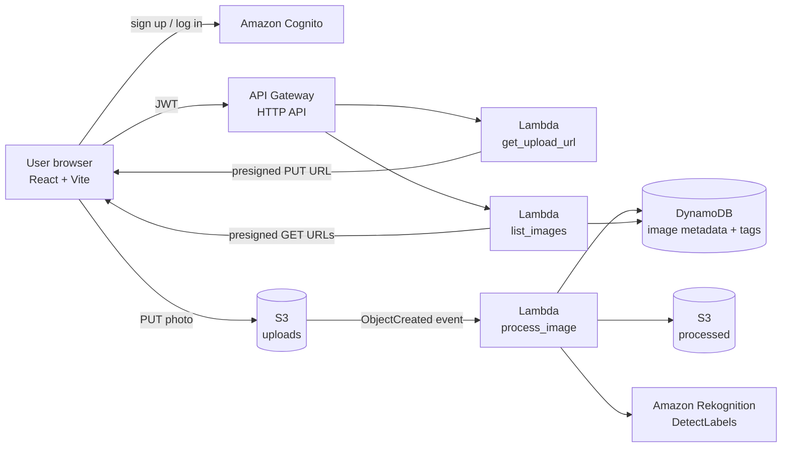

# PhotoVault: Serverless Image Upload & AI Tagging on AWS

A full-stack, event-driven photo gallery. Users sign up, upload photos straight to S3, and the backend automatically creates a thumbnail and a resized copy, then tags each image with Amazon Rekognition. The React frontend shows a gallery you can search by tag.

**Live demo:** https://preeminent-figolla-14691c.netlify.app/
**Region:** `ap-south-1` (Mumbai)

## Features

- Email sign-up and login with email verification (Amazon Cognito)
- Direct-to-S3 uploads using presigned URLs, so large files never pass through Lambda
- Automatic processing on upload: thumbnail, resized copy, and AI label detection
- Gallery with tag search, clickable tags, and a full-size viewer
- Per-user data isolation: a user can only see their own photos
- Entire backend defined as infrastructure as code (AWS SAM / CloudFormation)

## Architecture



### How a photo moves through the system

1. The browser asks `POST /upload-url` for permission to upload. The API verifies the Cognito JWT and returns a short-lived presigned S3 URL.
2. The browser uploads the file directly to the **uploads** bucket.
3. S3 triggers the **process_image** Lambda, which:
   - creates a thumbnail and a resized JPEG (Pillow) in the **processed** bucket,
   - calls Rekognition to detect labels (confidence 80% or higher),
   - saves the metadata and tags in DynamoDB.
4. The gallery calls `GET /images` (optionally `?tag=horse`) and receives short-lived presigned URLs for each image.

## Tech stack

| Layer | Technology |
|---|---|
| Frontend | React 18, Vite, `amazon-cognito-identity-js` |
| Auth | Amazon Cognito user pool (JWT authorizer on the API) |
| API | API Gateway HTTP API + AWS Lambda (Python 3.12) |
| Storage | Amazon S3 (private buckets, lifecycle rule on raw uploads) |
| Database | Amazon DynamoDB (on-demand billing) |
| AI | Amazon Rekognition (`DetectLabels`) |
| Hosting | S3 + CloudFront (defined in the template); demo also runs on Netlify |
| IaC | AWS SAM (CloudFormation) |

## API

All endpoints require an `Authorization: Bearer <Cognito ID token>` header.

| Method | Path | Description |
|---|---|---|
| `POST` | `/upload-url` | Body: `{"contentType": "image/jpeg"}`. Returns `uploadUrl` and `imageId`. Allowed types: JPEG, PNG, WebP |
| `GET` | `/images` | Lists the caller's images, newest first |
| `GET` | `/images?tag=horse` | Same, filtered by tag |

## Security decisions

- **User identity comes from the verified JWT**, never from the request body, so users can't read each other's photos.
- **Both image buckets are private** with all public access blocked. Images are served through short-lived presigned URLs.
- **Least-privilege IAM:** each Lambda gets only the S3 paths and DynamoDB table it needs. Rekognition is the one wildcard resource, because `DetectLabels` has no resource-level permissions.
- Uploads are restricted to image content types.
- Raw uploads expire after 30 days via an S3 lifecycle rule.
- CORS in the template allows only the CloudFront site and `localhost:5173`.

## Project structure

```
photovault/
├── backend/
│   ├── template.yaml              # all AWS infrastructure (SAM)
│   └── functions/
│       ├── get_upload_url/        # presigned upload URL
│       ├── process_image/         # S3 trigger: resize + Rekognition + DynamoDB
│       └── list_images/           # gallery API with tag filter
└── frontend/
    ├── index.html
    └── src/
        ├── App.jsx                # login, gallery, upload, lightbox
        ├── auth.js                # Cognito helpers
        └── api.js                 # API calls and S3 upload
```

## Getting started

### Prerequisites

AWS account, AWS CLI (configured), AWS SAM CLI, Docker, Node.js 18+ and Python 3.12.

### 1. Deploy the backend

```bash
cd backend
sam build --use-container
sam deploy --guided        # stack name: image-app, region: ap-south-1
```

Note the stack outputs: `ApiUrl`, `UserPoolId`, `UserPoolClientId`.

> Rekognition and CloudFront availability can vary by account and region. New AWS accounts may need to be verified by AWS Support before CloudFront distributions can be created.

### 2. Run the frontend locally

```bash
cd frontend
cp .env.example .env       # fill in the three values from the stack outputs
npm install
npm run dev                # http://localhost:5173
```

### 3. Deploy the frontend

```bash
npm run build
aws s3 sync dist s3://<FrontendBucketName> --delete
```

Or drop the `dist` folder on any static host.

## Cost

Everything is serverless and pay-per-use, so an idle deployment costs close to nothing. Rekognition and Lambda have free tiers; the main costs at scale would be Rekognition calls and S3 storage. A billing budget alert is recommended.

## Clean up

```bash
aws s3 rm s3://<uploads-bucket> --recursive
aws s3 rm s3://<processed-bucket> --recursive
aws s3 rm s3://<frontend-bucket> --recursive
sam delete
```

## Roadmap

- [ ] CI/CD with GitHub Actions (deploy backend and frontend on push)
- [ ] Custom domain with Route 53 and ACM
- [ ] Dead-letter queue for failed image processing
- [ ] Delete photos and shareable expiring links
- [ ] CloudWatch dashboard and alarms

## What I learned

- Designing an event-driven pipeline with S3 triggers and Lambda
- Using presigned URLs to move files without proxying them through a server
- Securing an API with Cognito JWT authorizers and per-user data access
- Writing infrastructure as code with SAM, and debugging CloudFormation rollbacks
- Handling S3 regional endpoints and CORS when serving from a browser app
